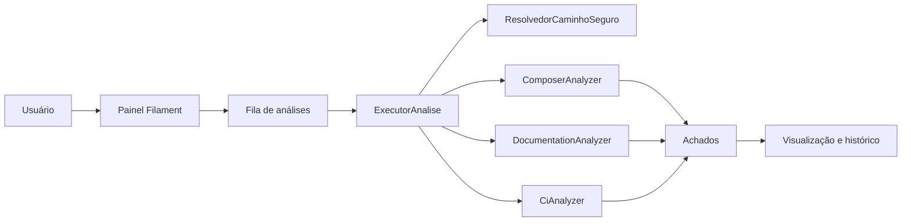

<a id="readme-top"></a>

<div align="center">
  <h1>LegacyLens</h1>

  <p>
    Diagnóstico técnico read-only para projetos PHP e Laravel legados.
  </p>

  <p>
    
    
    
  </p>

  <p>
    <a href="https://jeffersontadeu.vercel.app">
      
    </a>
    <a href="https://github.com/auhauhbr">
      
    </a>
    <a href="https://www.linkedin.com/in/jefferson-tadeu-dos-santos-0ab133380">
      
    </a>
  </p>

  <p>
    
    
    
    
    
    
    
  </p>
</div>

## Sobre o projeto

O LegacyLens é uma aplicação Laravel para inventariar e analisar projetos PHP e
Laravel legados sem modificar o código avaliado. A ferramenta transforma
evidências encontradas no repositório em achados técnicos rastreáveis, com
categoria, severidade, descrição, arquivo relacionado e recomendação.

O objetivo é reduzir a incerteza no início de uma modernização. Em vez de apenas
listar problemas, o projeto pretende conectar evidência, risco, impacto e ação
recomendada em um diagnóstico repetível e revisável.

> [!IMPORTANT]
> O LegacyLens está em desenvolvimento. Os analyzers de Composer, documentação e
> CI já funcionam; score definitivo, relatórios, plano técnico e outros analyzers
> ainda fazem parte das próximas etapas do MVP.

## Estado atual

Já estão implementados:

- autenticação e painel administrativo com Filament;
- cadastro e visualização de projetos locais;
- execução de análises por fila;
- histórico de análises e visualização de achados;
- validação segura do diretório analisado;
- executor de processos com comandos fixos, timeout e limite de saída;
- leitura passiva de `composer.json` e `composer.lock`;
- detecção da restrição de PHP, Laravel e dependências principais;
- detecção de ferramentas de testes, análise estática e formatação no Composer;
- análise de README, `.env.example` e diretórios de documentação;
- análise passiva de GitHub Actions, GitLab CI e Bitbucket Pipelines;
- detecção de testes e ferramentas de qualidade declaradas no CI;
- persistência de achados com evidência e recomendação;
- testes automatizados para domínio, infraestrutura, painel e analyzers.

## Exemplo de análise real

Durante o desenvolvimento, uma cópia local do projeto open source
[Crater Invoice](https://github.com/crater-invoice-inc/crater) foi usada como
projeto de demonstração:

```bash
git clone --depth 1 https://github.com/crater-invoice-inc/crater.git legacy-demo-crater
```

O LegacyLens identificou, entre outros sinais:

- restrições de PHP e Laravel declaradas no Composer;
- presença do `.env.example`;
- configuração de CI em `.github/workflows/ci.yaml`;
- ausência aparente de ferramenta de análise estática no Composer;
- ausência aparente de Pint, PHPStan, Larastan ou `composer validate` na pipeline.

Exemplo de achado gerado:

```text
Código: ci.qualidade_ausente
Categoria: integracao_continua
Severidade: baixa
Arquivo: .github/workflows/ci.yaml

Verificações de qualidade ausentes no CI

Não foram encontrados sinais de Pint, PHPStan, Larastan ou composer validate
na pipeline.

Recomendação: adicionar ao menos uma verificação automatizada de estilo,
análise estática ou validação do Composer.
```

Os resultados são sinais técnicos produzidos por heurísticas e devem ser
revisados por uma pessoa antes de orientar mudanças no projeto analisado.

## Como funciona



Os analyzers recebem um diretório previamente validado, fazem somente leituras
controladas e retornam dados normalizados. A `FabricaAchados` persiste os
resultados associados à análise para consulta no painel.

## Segurança e princípio read-only

O projeto analisado é tratado como entrada não confiável. No MVP, o LegacyLens:

- não cria, altera, move ou remove arquivos do projeto analisado;
- não lê nem armazena o `.env` real;
- rejeita symlinks nas leituras implementadas pelos analyzers atuais;
- limita o tamanho dos arquivos lidos;
- não executa workflows ou comandos encontrados no repositório;
- não aceita comandos arbitrários enviados pelo usuário;
- não instala nem atualiza dependências do projeto analisado;
- não publica issues sem aprovação humana.

As operações permitidas pela infraestrutura são definidas em uma allowlist:

```text
composer audit --format=json
composer outdated --format=json
php artisan route:list --json
git rev-parse --abbrev-ref HEAD
```

Nem todas essas operações já possuem analyzer integrado ao fluxo atual.

## Tecnologias

| Tecnologia | Uso no projeto |
|---|---|
| [Laravel](https://laravel.com/) | Aplicação, domínio, persistência, filas e testes de integração |
| [PHP](https://www.php.net/) | Analyzers, serviços de domínio e regras de segurança |
| [Filament](https://filamentphp.com/) | Painel administrativo e recursos de projetos, análises, achados e relatórios |
| [Livewire](https://livewire.laravel.com/) | Interações reativas do painel Filament |
| [MySQL](https://www.mysql.com/) ou [PostgreSQL](https://www.postgresql.org/) | Persistência prevista para os ambientes da aplicação |
| [Tailwind CSS](https://tailwindcss.com/) | Estilos dos assets da interface |
| [Vite](https://vite.dev/) | Build dos assets da aplicação |
| [PHPUnit](https://phpunit.de/) | Testes unitários e de integração |
| [Laravel Pint](https://laravel.com/docs/pint) | Padronização do código PHP |

## Estrutura principal

```text
LegacyLens/
├── app/
│   ├── Dominio/Analises/
│   │   ├── Analisadores/
│   │   ├── DTO/
│   │   └── Servicos/
│   ├── Enums/
│   ├── Filament/Resources/
│   ├── Jobs/
│   └── Models/
├── config/
├── database/
│   ├── factories/
│   └── migrations/
├── resources/
├── routes/
└── tests/
    ├── Feature/
    └── Unit/
```

## Requisitos

- PHP 8.3 ou superior;
- Composer 2;
- extensões PHP exigidas pelo Laravel, incluindo `intl`, `mbstring`, `pdo`,
  `openssl` e `xml`;
- MySQL 8+, PostgreSQL 15+ ou SQLite para testes;
- Node.js 20 ou superior e npm.

## Instalação local

Clone o repositório e instale as dependências da própria aplicação LegacyLens:

```bash
git clone https://github.com/auhauhbr/LegacyLens.git
cd LegacyLens
composer install
npm install
cp .env.example .env
php artisan key:generate
```

Configure o banco de dados no `.env` local e execute:

```bash
php artisan migrate
npm run build
php artisan serve
```

Acesse o painel em:

```text
http://127.0.0.1:8000/admin
```

> [!WARNING]
> Use somente caminhos de projetos que você tem autorização para analisar. Não
> copie para o LegacyLens o `.env` real de nenhum projeto avaliado.

## Desenvolvimento

Para iniciar servidor, worker, logs e Vite em conjunto:

```bash
composer dev
```

Ou execute os processos separadamente:

```bash
php artisan serve
php artisan queue:work
npm run dev
```

## Iniciar uma análise

1. Acesse `/admin/projetos`.
2. Cadastre um projeto com origem local e informe seu diretório absoluto.
3. Use a ação **Iniciar análise**.
4. Acompanhe o resultado nos recursos de análises e achados.

A execução é enviada para a fila. Mantenha o worker do LegacyLens ativo:

```bash
php artisan queue:work
```

Também é possível iniciar o fluxo pelo Tinker:

```php
$projeto = App\Models\Projeto::query()->firstOrFail();
$analise = app(App\Dominio\Analises\Servicos\IniciadorAnalise::class)->iniciar($projeto);
```

## Testes e validações

```bash
php artisan test
./vendor/bin/pint --test
composer validate --strict
```

## Roadmap do MVP

- [x] Bootstrap Laravel, autenticação e painel Filament;
- [x] models, migrations e recursos administrativos principais;
- [x] infraestrutura segura de análise e execução por fila;
- [x] `ComposerAnalyzer`;
- [x] `DocumentationAnalyzer`;
- [x] `CiAnalyzer`;
- [ ] analyzers de auditoria e dependências desatualizadas;
- [ ] analyzers de hotspots, rotas, testes, queries e código de debug;
- [ ] cálculo definitivo de score e nível de risco;
- [ ] relatório executivo e plano técnico em Markdown;
- [ ] etapas de modernização;
- [ ] rascunhos revisáveis de issues do GitHub;
- [ ] dados de demonstração do MVP.

## Como contribuir

Contribuições são bem-vindas enquanto o projeto evolui. Antes de começar:

1. abra uma issue descrevendo a proposta ou o problema;
2. mantenha mudanças pequenas, testáveis e compatíveis com o princípio read-only;
3. não inclua código, credenciais ou dados de projetos privados nos testes;
4. execute os testes e validadores antes de enviar um pull request.

Ao relatar um bug, prefira um projeto fake mínimo ou um repositório público que
permita reproduzir o comportamento.

## Relato de segurança

Não publique tokens, credenciais, `.env`, código proprietário ou outros dados
sensíveis em issues. Para comunicar uma vulnerabilidade, entre em contato
diretamente pelo e-mail informado abaixo até que exista uma política de segurança
dedicada no repositório.

## Licença

O `composer.json` declara o projeto sob a licença MIT. Antes de distribuir ou
aceitar contribuições sob esses termos, o repositório também deve possuir um
arquivo `LICENSE` com o texto integral da licença e a identificação do titular.

## Autor e contato

- Autor: Jefferson Tadeu dos Santos
- Portfólio: [jeffersontadeu.vercel.app](https://jeffersontadeu.vercel.app)
- GitHub: [github.com/auhauhbr](https://github.com/auhauhbr)
- LinkedIn: [Jefferson Tadeu dos Santos](https://www.linkedin.com/in/jefferson-tadeu-dos-santos-0ab133380)
- E-mail: [tadeu.santos7148@gmail.com](mailto:tadeu.santos7148@gmail.com)

<p align="right">(<a href="#readme-top">voltar ao topo</a>)</p>
